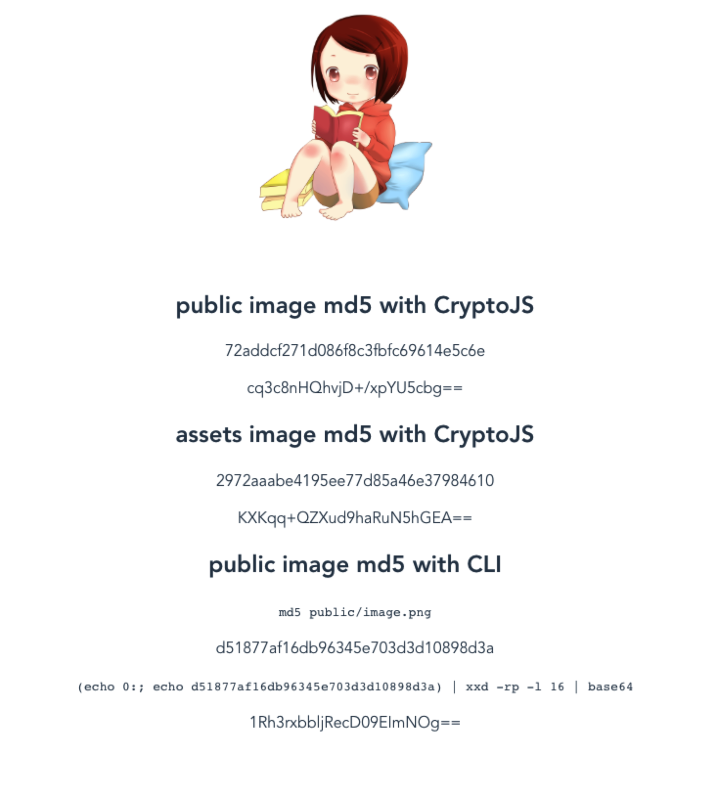

# cryptojs-demo

## md5 puzzle

When I get md5 of the same image by different way, it get different result.



## Project setup

```bash
yarn install
```

### Compiles and hot-reloads for development

```bash
yarn run serve
```

### Compiles and minifies for production

```bash
yarn run build
```

### Run your tests

```bash
yarn run test
```

### Lints and fixes files

```bash
yarn run lint
```

### Customize configuration

See [Configuration Reference](https://cli.vuejs.org/config/).
